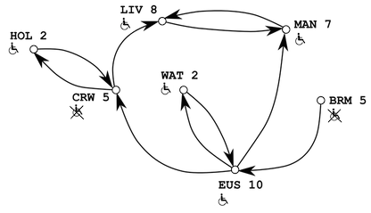

# Lecture 31

## Questions

- We add the `encapsulated` tag to the template tag, not because of accumulator (because accumulator implies encapsulation), but rather due to `fn-for-stn` and `fn-for-los`.

## Notes

- Final exam will not ask you to make a function operating on an arbitrary-arity tree or graph tail recursive. However, this information is still important!

## Templating Cyclic Data

{ width: 50% }

- Representing data, key insight: from any given node, a graph looks like an arbtitrary arity tree
- Insteading of returning one name in `shared`, we return a list so we can start at any position!
- Our `add-param` `to` does NOT change, so we don't need to include it in every function.

With our initial version of the function, we treat it as an arb-tree problem. But we get stuck in an infinite loop when we hit a cycle! So we need a *context preserving accumulator* to keep track of where we've been to get "unstuck" from this loop.

- Not *result so far accumulator* because knowing what the result is doesn't help us get unstuck from the loop.
- Not *worklist accumulator* because it only tells us what we have left to do, which doesn't tell us where we've been.

`visited` is a list of station names that we have been to. When we visit a node (in `fn-for-stn`), if this station is in `visited`, just return false, don't recurse. Otherwise, we need to keep track of this station, so add its name to `visited` and proceed by recursing.
