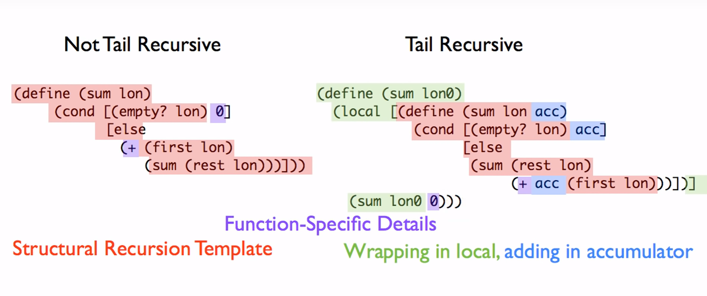

# Module 10: Accumulators

## Learning goals

Structural recursion (on its own) doesn't let us see (1) where we've been in the traversal or (2) the work remaining to be done.

- Identify when a function design requires the use of accumulator.
- Work with the accumulator design recipe to design such functions.

- Understand and explain the concepts of tail position, tail call and tail recursion.

## Terminology

- **Accumulator invariant**: something that is always true about the accumulator (even if the exact value varies); varying quantity about a fact which does not vary
  - First accumulator comment in function

## Accumulators

Three types of accumulators:

1. Context preserving
2. Result so far
3. Worklist

## Accumulator HtDF Recipe

Main Idea

1. Structural recursion template
2. Wrap function in outer function, local, and trampoline
3. Add additional accumulator parameter

Three steps when filling in accumulator

1. Initialize accumualtor
2. Use/exploit accumulator value
    - Assume `acc` comment on what the accumulator represents is correct
3. Update accumulator to preserve invariant
    - Ensure `acc` value keeps invariant true

Full Recipe

1. Signature, purpose, stub.
2. Examples wrapped in `check-expect`s.
3. Template and inventory.
    - Template as usual
    - Wrap in function with same name; rename outer param (eg. `lox0`)
    - Trampoline: call inner function with outer param name
    - Add param to inner function; **add to each `...`**
    - In calls to inner function: specify type, invariant, and examples of accumulator
4. Code function body
5. Test and debug until correct

Example template operating on a list:

```racket
(@template (listof X) encapsulated accumulator)
(define (skip1 lox0)
  ;; acc: Natural; 1-based index of (first lox) in lox0
  ;; (skip1 (list "a" "b" "c") 1)
  ;; (skip1 (list     "b" "c") 2)
  ;; (skip1 (list         "c") 3)
  (local [(define (skip1 lox acc)
            (cond [(empty? lox) (... acc)]
                  [else
                   (... acc
                        (first lox)
                        (skip1 (rest lox)
                               (... acc)))]))]

    (skip1 lox0 ...)))
```

`add1` updates the accumulator to **preserve the invariant**.

## Tail Call Optimization (Tail Recursion)

Tail recursion avoids pending computations in recursive calls.

An expression is in **tail position** if it evaluates to the same thing as the enclosing function ([further reading](https://docs.racket-lang.org/reference/eval-model.html#%28tech._continuation%29)).

```racket
(define (foo a)
    1)
```

`1` is in tail position because it evaluates the same thing that the enclosing function, `foo`, evaluates to.

```racket
(define (bar b)
    (cond [(empty? b) (+ 1 2)]
          [else (bar (+ 4 5))]))
```

The only expressions in tail position are `(+ 1 2)` and `(bar (+ 4 5))`.

If a a function's expression in tail position is NOT the function itself, the function will have to wait for other work to be done before it can produce a result.

On the other hand, if a function's expression in tail position IS the function itself, it can say "Hey, I'm just going to return whatever this function returns. I don't need to stick around for any longer," and thus its frame is replaced.

**In other words, we implement tail recursion by making suring the recursive call is in tail position.**

## Tail Call Optimization Process

1. Template according to accumulator recipe.
2. Delete part of template wrapping around recursive call.
    - _This is the context we need to eliminate!_
3. Computation that would have been recursive call -> moves to be in accumulator argument position.

This diagram shows how a template for `sum` (sum of all `Number`s in `(listof Number)`) incorporates each template.



Equivalent abstract fold/reduce functions:

- Not Tail Recursive: `(foldr + 0 <the list>)`
- Tail Recursive: `(foldl + 0 <the list>)`
  - **`foldl` is the tail recursive abstract fold function for lists.**
