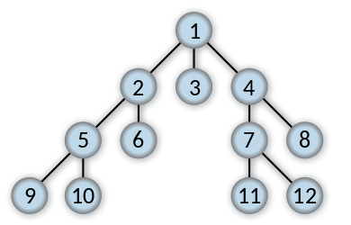

# Module 10: Accumulators


## Table of Contents

- [Module 10: Accumulators](#module-10-accumulators)
    - [Table of Contents](#table-of-contents)
    - [Learning goals](#learning-goals)
    - [Terminology](#terminology)
    - [Accumulators](#accumulators)
    - [Important Notes](#important-notes)
    - [Accumulator HtDF Recipe](#accumulator-htdf-recipe)
    - [Tail Call Optimization (Tail Recursion)](#tail-call-optimization-tail-recursion)
        - [Tail Call Optimization Process](#tail-call-optimization-process)
    - [Worklist Accumulator](#worklist-accumulator)
        - [Course Video: `same-house-as-parent` Function Structure](#course-video-same-house-as-parent-function-structure)

## Learning goals

Structural recursion (on its own) doesn't let us see (1) where we've been in the traversal or (2) the work remaining to be done.

- Identify when a function design requires the use of accumulator.
- Work with the accumulator design recipe to design such functions.

- Understand and explain the concepts of tail position, tail call and tail recursion.

## Terminology

- **Accumulator invariant**: something that is always true about the accumulator (even if the exact value varies); varying quantity about a fact which does not vary
  - First accumulator comment in function

## Accumulators

Three types of accumulators:

1. **Context preserving**: preserve context lost in natural recursion
2. **Result so far**: eliminate pending operations _(to achieve tail recursion)_
    - Add to all functions
    - For arb-tree: only one function changes the RSF, `lox` function returns it as a base case
3. **Worklist**: eliminate need to retain future recursive calls in pending operations _(to achieve tail recursion)_
    - Tail recursive traversal for arb-tree: requires a worklist accumulator.
        - Add param `todo` to node function, rename `lox` to `todo` in `lox` function

## Important Notes

- With mutually recursive functions, must add accumulator to ALL the functions.
- Add notes in `(parens)` to your `acc` docs if your cases have any special behaviour (e.g. empty string `""` for root of tree)

## Accumulator HtDF Recipe

Main Idea

1. Structural recursion template
2. Wrap function in outer function, local, and trampoline
3. Add additional accumulator parameter

Three steps when filling in accumulator

1. Initialize accumulator
2. Use/exploit accumulator value
    - Assume comment on what the accumulator represents is correct
3. Update accumulator to preserve invariant
    - Ensure value of `acc` keeps invariant true

Full Recipe

1. Signature, purpose, stub.
2. Examples wrapped in `check-expect`s.
3. Template and inventory.
    - Template as usual
    - Wrap in function with same name; rename outer param (eg. `lox0`)
    - Trampoline: call inner function with outer param name
    - Add param to inner function; **add to each `...`**
    - In calls to inner function: specify type, invariant, and examples of accumulator
4. Code function body
5. Test and debug until correct

Example template operating on a list:

```racket
(@template (listof X) encapsulated accumulator)
(define (skip1 lox0)
  ;; acc: Natural; 1-based index of (first lox) in lox0
  ;; (skip1 (list "a" "b" "c") 1)
  ;; (skip1 (list     "b" "c") 2)
  ;; (skip1 (list         "c") 3)

  (local [(define (skip1 lox acc)
            (cond [(empty? lox) (... acc)]
                  [else
                   (... acc
                        (first lox)
                        (skip1 (rest lox)
                               (... acc)))]))]

    (skip1 lox0 ...)))
```

`add1` updates the accumulator to **preserve the invariant**.

## Tail Call Optimization (Tail Recursion)

Tail recursion avoids pending computations in recursive calls. To ensure optimization, **ALL recursive calls must be in tail position**.

An expression is in **tail position** if it evaluates to the same thing as the enclosing function ([further reading](https://docs.racket-lang.org/reference/eval-model.html#%28tech._continuation%29)).

```racket
(define (foo a)
    1)
```

`1` is in tail position because it evaluates the same thing that the enclosing function, `foo`, evaluates to.

```racket
(define (bar b)
    (cond [(empty? b) (+ 1 2)]
          [else
           (+ 4 (bar (+ 4 5))]))
```

`(bar (+ 4 5))` is the only recursive call and is NOT in tail position due to the enclosing `(+ 4`. This function is not tail call optimized.

### Tail Call Optimization Process

1. Template according to accumulator recipe.
2. Delete part of template wrapping around recursive call.
    - _This is the context we need to eliminate!_
3. Computation that would have been recursive call -> moves to be in accumulator argument position.

This diagram shows how a template for `sum` (sum of all `Number`s in `(listof Number)`) incorporates each template.


Equivalent abstract fold/reduce functions:

- Not Tail Recursive: `(foldr + 0 <the list>)`
- Tail Recursive: `(foldl + 0 <the list>)`
  - **`foldl` is the tail recursive abstract fold function for lists.**

## Worklist Accumulator

To traverse an arbitary-arity tree with a trail recursive function, we need a worklist accumulator.

Using the example in the videos, we can explore the `Wizard` tree with two different methods. Depth first and breadth first.

```racket
;; Depth first
(define (fn-for-wiz w todo rsf)
            (fn-for-low (append (wiz-children w) todo)
                        (add1 rsf)))
```

```racket
;; Breadth first
(define (fn-for-wiz w todo rsf)
            (fn-for-low (append todo (wiz-children w))
                        (add1 rsf)))
```

{ width=50% }

{ width=50% }

### Course Video: `same-house-as-parent` Function Structure

This section is in reference to the Harry Potter problem covered by the course videos. The image below shows how many different structures/templates--which just encapsulate ideas about each component of how an algorithm functions--come together to solve a problem in a systematic way.


Below is the general thought process we followed to build this function. Don't use it as a linear steps of instructions. Instead, use it to understand why we made each decision.

Let ADD-TEM represent adding a component to the template.

1. ADD-TEM: `Wizard` arb-tree template.
    1. `(@template Wizard)`
2. ADD-TEM: Worklist accumulator (always need this for *tail recursive* traversal of arbitrary arity tree).
    1. `(@template Wizard accumulator)`
    2. Invariant comment
    3. Add `todo` param, typically after the node param.
    4. Rename `lox` to `todo` in `fn-for-low`
    5. Wrap subs in `(append <subs> todo)`
        1. We also wrap subs in `(... <subs>)` because we know the worklist entires are going to be compound.
        2. It will be compound because we must preserve the "parent house" context.
    6. Make both functions tail recursive
        1. Comment out template details
        2. Merge `fn-for-wiz` and `fn-for-low` calls
3. ADD-TEM: Result so far accumulator (for result, the list of names).
    1. Invariant comment: same type as function produces
    2. Add param to both functions, insert `(... rsf)` and `rsf`
    3. The last step on `rsf` is the `(empty? todo)` case in `fn-for-low`; sometimes we need to transform `rsf` as a final step

At this point in time, our template looks like this,

```racket
(@template Wizard accumulator)
(define (inherits-house w)
  ;; todo: (listof ...); worklist accumulator
  ;; rsf: (listof String); result so far accumulator ("" for head of tree)

  (local [(define (fn-for-wiz w todo rsf)
            ; (... (wiz-name w) (wiz-house w)
            (fn-for-low (append (... (wiz-children w)) todo)
                        (... rsf)))

          (define (fn-for-low todo rsf)
            (cond [(empty? todo) rsf]
                  [else
                   (fn-for-wiz (first todo)
                               (rest todo)
                               (... rsf))]))]

    (fn-for-wiz w ... ...)))
```

We have one more thing to do before we start filling in the details; we must create our compound worklist element.

4. ADD-TEM: Compound data definition for `wle` (worklist element).
    1. `w` for current `Wizard`, `ph` for this `Wizard`'s parent house.
    2. These elements represent each node we still need '`todo`' work for.
5. Add `ph` param to `fn-for-wiz`.
    1. `wle` definition reminds us that we need to give `ph` to `fn-for-wiz`, because this is the function responsible for creating `wle` elements.
    2. `ph` is not exactly a context preserving accumulator on its own.
    3. Rather, `ph` is context preserved *within* each worklist-acc entry.
    4. We 'unpack' a `wle` in `fn-for-low` and 'pack up' a `wle` in `fn-for-wiz`.
6. ADD-TEM: Filter functionality for `rsf` (to build the result we've wanted all along).
    1. This is a detail specific to what we want our function to produce.
    2. `fn-for-wiz` is responsible for modifying `rsf`. `fn-for-low` does not change `rsf`.
    3. We finally incorporate the commented out template; `(... (wiz-name w (wiz-house w))`

After creating `wle`, adding the `ph` param, packing and unpacking `wle`, and adding the "filter" functionality, our function looks like this,

```racket
(@template Wizard accumulator)
(define (inherits-house w)
  ;; todo: (listof WLE); worklist accumulator
  ;; rsf: (listof String); result so far accumulator ("" for head of tree)

  (local [(define-struct wle (w ph))
          ;; WLE (worklist entry) is (make-wle Wizard House)
          ;; interp. a worklist entry with wizard to pass to fn-for-wiz
          ;;         and this wizard's parent house

          (define (fn-for-wiz w ph todo rsf)
            (fn-for-low (append (map (λ (c) (make-wle c (wiz-house w)))
                                     (wiz-children w)) ; `packing` wle
                                todo)
                        (if (string=? (wiz-house w) ph)
                            (cons (wiz-name w) rsf)
                            rsf)))

          (define (fn-for-low todo rsf)
            (cond [(empty? todo) rsf]
                  [else
                   (fn-for-wiz (wle-w (first todo))  ; 'unpacking' wle
                               (wle-ph (first todo)) ; <-- here as well
                               (rest todo)
                               rsf)]))]

    (fn-for-wiz w ... ... ...)))
```

7. Initialize arguments in trampoline call.
    1. This is the last step. This and step 6 relate very closely to the details of the problem.
    2. `(fn-for-wiz w "" empty empty)`
